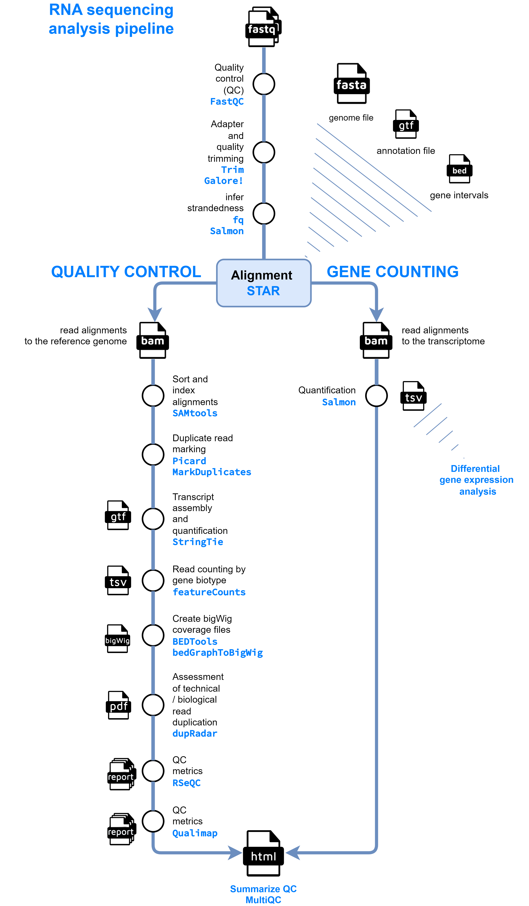

#  

[](https://github.com/nf-core/rnaseq/actions?query=workflow%3A%22nf-core+CI%22)
[](https://github.com/nf-core/rnaseq/actions?query=workflow%3A%22nf-core+linting%22)[](https://nf-co.re/rnaseq/results)[](https://doi.org/10.5281/zenodo.1400710)

[](https://www.nextflow.io/)
[](https://docs.conda.io/en/latest/)
[](https://www.docker.com/)
[](https://sylabs.io/docs/)
[](https://tower.nf/launch?pipeline=https://github.com/nf-core/rnaseq)

[](https://nfcore.slack.com/channels/rnaseq)[](https://twitter.com/nf_core)[](https://mstdn.science/@nf_core)[](https://www.youtube.com/c/nf-core)

## Introduction

**nf-core/rnaseq** is a bioinformatics pipeline that can be used to analyse RNA sequencing data obtained from organisms with a reference genome and annotation. It takes a samplesheet and FASTQ files as input, performs quality control (QC), trimming and (pseudo-)alignment, and produces a gene expression matrix and extensive QC report.

This repository is a customized version of `nf-core/rnaseq v3.14.0`, adapted with specific plugins for the UKHD environment. The pipeline includes essential default parameters and disables unnecessary features. For detailed information, refer to the full `nf-core/rnaseq` documentation [here](https://nf-co.re/rnaseq/3.14.0/). 



## RNA-seq Data Analysis Workflow

1. **Prepare Reference Files**: Obtain the reference genome, annotation file, and bed file.

2. **Sub-sample FastQ Files and Infer Strandedness**: Use [`fq`](https://github.com/stjude-rust-labs/fq) and [`Salmon`](https://combine-lab.github.io/salmon/) to sub-sample FastQ files and auto-infer strandedness.

3. **Read Quality Control (QC)**: Assess read quality with [`FastQC`](https://www.bioinformatics.babraham.ac.uk/projects/fastqc/).

4. **Adapter and Quality Trimming**: Trim adapters, low-quality bases, and polyA tails using [`Trim Galore!`]https://www.bioinformatics.babraham.ac.uk/projects/trim_galore/).

5. **Alignment and Quantification**
   - Perform alignment with [`STAR`](https://github.com/alexdobin/STAR).
   - Quantify transcripts with [`Salmon`](https://combine-lab.github.io/salmon/).

6. **Sort and Index Alignments**: Use [`SAMtools`](https://sourceforge.net/projects/samtools/files/samtools/) to sort and index alignment files.

7. **Duplicate Read Marking**: Mark duplicate reads (do not remove) with [`picard MarkDuplicates`](https://broadinstitute.github.io/picard/).

8. **Transcript Assembly and Quantification**: Assemble transcripts and perform quantification using [`StringTie`](https://ccb.jhu.edu/software/stringtie/).

9. **Create BigWig Coverage Files**: Create `bigWig` files for IGV to visualize coverage tracks and analyze read distribution and genomic features using [`BEDTools`](https://github.com/arq5x/bedtools2/) and [`bedGraphToBigWig`](http://hgdownload.soe.ucsc.edu/admin/exe/).

10. **Extensive Quality Control**
    - **Technical/Biological Read Duplication**: Assess with [`dupRadar`](https://bioconductor.org/packages/release/bioc/html/dupRadar.html).
    - **Various RNA-seq QC Metrics**: Evaluate using [`Qualimap`](http://qualimap.bioinfo.cipf.es/) and [`RSeQC`](http://rseqc.sourceforge.net/).

11. **Present QC Results**: Present quality control metrics for raw reads, alignment, gene biotype, sample similarity, and strand-specificity using [`MultiQC`](http://multiqc.info/) and [`R`](https://www.r-project.org/).

## Installation
First, install Nextflow using Conda and set up the required plugins and environment variables.

```bash
Copy code
# Install Nextflow via Conda
$ conda install -c bioconda nextflow

# Clone the pipeline repository
git clone https://github.com/lucianhu/rnaseq_nextflow.git

# Copy plugins to Nextflow directory
cp rnaseq_nextflow/plugins ~/.nextflow

# Set the Conda cache directory for Nextflow
echo "export NXF_CONDA_CACHEDIR=$HOME/.conda/cache_nextflow" >> ~/.bashrc

# Source the updated bashrc to apply the changes
source ~/.bashrc
```

> [!NOTE]
> If you are new to Nextflow and nf-core, please refer to [this page](https://nf-co.re/docs/usage/installation) on how to set-up Nextflow.

## Usage

### Prepare a Samplesheet
First, prepare a samplesheet with your input data. The samplesheet should be a CSV file formatted as follows:

`samplesheet.csv`
```csv
sample,fastq_1,fastq_2,strandedness
CONTROL_REP1,AEG588A1_S1_L001_R1_001.fastq.gz,AEG588A1_S1_L001_R2_001.fastq.gz,auto
CONTROL_REP1,AEG588A1_S1_L002_R1_001.fastq.gz,AEG588A1_S1_L002_R2_001.fastq.gz,auto
CONTROL_REP2,AEG588A1_S1_L003_R1_001.fastq.gz,AEG588A1_S1_L003_R2_001.fastq.gz,auto
CONTROL_REP2,AEG588A1_S1_L004_R1_001.fastq.gz,AEG588A1_S1_L004_R2_001.fastq.gz,auto
CONTROL_REP3,AEG588A1_S1_L005_R1_001.fastq.gz,AEG588A1_S1_L005_R2_001.fastq.gz,auto
CONTROL_REP3,AEG588A1_S1_L006_R1_001.fastq.gz,AEG588A1_S1_L006_R2_001.fastq.gz,auto
TREATMENT_REP1,AEG588A1_S1_L007_R4_001.fastq.gz,AEG588A1_S1_L007_R2_001.fastq.gz,auto
TREATMENT_REP1,AEG588A1_S1_L008_R1_001.fastq.gz,AEG588A1_S1_L008_R2_001.fastq.gz,auto
TREATMENT_REP2,AEG588A1_S1_L009_R5_001.fastq.gz,AEG588A1_S1_L009_R2_001.fastq.gz,auto
TREATMENT_REP2,AEG588A1_S1_L010_R1_001.fastq.gz,AEG588A1_S1_L010_R2_001.fastq.gz,auto
TREATMENT_REP3,AEG588A1_S1_L011_R1_001.fastq.gz,AEG588A1_S1_L011_R2_001.fastq.gz,auto
TREATMENT_REP3,AEG588A1_S1_L012_R1_001.fastq.gz,AEG588A1_S1_L012_R2_001.fastq.gz,auto
```

Each row represents a single-end fastq file or a pair of fastq files (paired-end). Rows with the same sample identifier are considered technical replicates and will be merged automatically. The strandedness of the library preparation will be automatically inferred if set to auto.

### Prepare a Parameters File

Prepare a YAML file with the necessary pipeline parameters. 

`nf-params-rna.yaml`
```yaml
input: '/path/to/samplesheet.csv'
outdir: '/path/to/output_dir'
fasta: '/path/to/references/genome.fa'
gtf: '/path/to/references/annotation.gtf'
gene_bed: '/path/to/references/annotation.bed' # If this file is not available, the pipeline will automatically create it
star_index: '/path/to/genome/star_index_dir'
save_trimmed: true
save_align_intermeds: true
```

> [!WARNING]
> Please provide pipeline parameters via the CLI or Nextflow `-params-file` option. Custom config files including those provided by the `-c` Nextflow option can be used to provide any configuration _**except for parameters**_;
> see [docs](https://nf-co.re/usage/configuration#custom-configuration-files).

### Run the Pipeline

Execute the Nextflow pipeline using the following command:

```bash
$ nextflow run /path/to/rnaseq_nextflow/main.nf -profile conda -params-file nf-params-rna.yaml -work-dir path/to/work_dir
```

> [!WARNING]
> Running Nextflow on Docker is insecure and requires administrative privileges. Using Conda is more secure and allows users to run Nextflow without needing special permissions.

### Run Testing Sample
To run a test sample, navigate to the test datasets directory and execute the pipeline:

```bash
$ cd rnaseq_nextflow/test-datasets
$ nextflow run /path/to/rnaseq_nextflow/main.nf -profile conda -params-file nf-params-rna.yaml -work-dir path/to/work_dir
```

This will process the test datasets and ensure the pipeline is functioning correctly.

For more details and further functionality, please refer to the [usage documentation](https://nf-co.re/rnaseq/usage) and the [parameter documentation](https://nf-co.re/rnaseq/parameters).

## Pipeline output

For a summary of the results and a brief explanation of the tools used in the UKHD system, please visit: [UKHD Output Documentation](https://github.com/lucianhu/rnaseq_nextflow/blob/master/docs/output_UKHD.md). For detailed outputs and reports with full parameters, refer to the [nf-core output documentation](https://nf-co.re/rnaseq/output).

This pipeline quantifies RNA-sequenced reads against genes/transcripts in the genome and normalizes the data. However, it does not perform statistical comparisons to determine significance using FDR or P-values. For further analysis, you can examine the output files in statistical environments such as R or Julia, or use the [nf-core/differentialabundance](https://nf-co.re/differentialabundance) pipeline.

## Online videos

A short talk about the history, current status and functionality on offer in this pipeline was given by Harshil Patel ([@drpatelh](https://github.com/drpatelh)) on [8th February 2022](https://nf-co.re/events/2022/bytesize-32-nf-core-rnaseq) as part of the nf-core/bytesize series.

You can find numerous talks on the [nf-core events page](https://nf-co.re/events) from various topics including writing pipelines/modules in Nextflow DSL2, using nf-core tooling, running nf-core pipelines as well as more generic content like contributing to Github. Please check them out!

## Credits

These scripts were originally written for use at the [National Genomics Infrastructure](https://ngisweden.scilifelab.se), part of [SciLifeLab](http://www.scilifelab.se/) in Stockholm, Sweden, by Phil Ewels ([@ewels](https://github.com/ewels)) and Rickard Hammarén ([@Hammarn](https://github.com/Hammarn)).

The pipeline was re-written in Nextflow DSL2 and is primarily maintained by Harshil Patel ([@drpatelh](https://github.com/drpatelh)) from [Seqera Labs, Spain](https://seqera.io/).

The pipeline workflow diagram was initially designed by Sarah Guinchard ([@G-Sarah](https://github.com/G-Sarah)) and James Fellows Yates ([@jfy133](https://github.com/jfy133)), further modifications where made by Harshil Patel ([@drpatelh](https://github.com/drpatelh)) and Maxime Garcia ([@maxulysse](https://github.com/maxulysse)).

Many thanks to other who have helped out along the way too, including (but not limited to):

- [Alex Peltzer](https://github.com/apeltzer)
- [Colin Davenport](https://github.com/colindaven)
- [Denis Moreno](https://github.com/Galithil)
- [Edmund Miller](https://github.com/Emiller88)
- [Gregor Sturm](https://github.com/grst)
- [Jacki Buros Novik](https://github.com/jburos)
- [Lorena Pantano](https://github.com/lpantano)
- [Matthias Zepper](https://github.com/MatthiasZepper)
- [Maxime Garcia](https://github.com/maxulysse)
- [Olga Botvinnik](https://github.com/olgabot)
- [@orzechoj](https://github.com/orzechoj)
- [Paolo Di Tommaso](https://github.com/pditommaso)
- [Rob Syme](https://github.com/robsyme)

## Contributions and Support

If you would like to contribute to this pipeline, please see the [contributing guidelines](.github/CONTRIBUTING.md).

For further information or help, don't hesitate to get in touch on the [Slack `#rnaseq` channel](https://nfcore.slack.com/channels/rnaseq) (you can join with [this invite](https://nf-co.re/join/slack)).

## Citations

If you use nf-core/rnaseq for your analysis, please cite it using the following doi: [10.5281/zenodo.1400710](https://doi.org/10.5281/zenodo.1400710)

An extensive list of references for the tools used by the pipeline can be found in the [`CITATIONS.md`](CITATIONS.md) file.

You can cite the `nf-core` publication as follows:

> **The nf-core framework for community-curated bioinformatics pipelines.**
>
> Philip Ewels, Alexander Peltzer, Sven Fillinger, Harshil Patel, Johannes Alneberg, Andreas Wilm, Maxime Ulysse Garcia, Paolo Di Tommaso & Sven Nahnsen.
>
> _Nat Biotechnol._ 2020 Feb 13. doi: [10.1038/s41587-020-0439-x](https://dx.doi.org/10.1038/s41587-020-0439-x).
